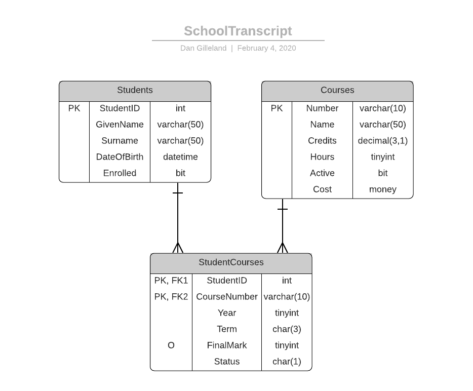

# Databases, Servers, and SSMS

> If you haven't already, you should install the [**mssql**](https://marketplace.visualstudio.com/items?itemName=ms-mssql.mssql) extension for VS Code. Also, refer to the [SQL Server extension for Visual Studio Code](https://learn.microsoft.com/en-us/sql/tools/visual-studio-code/sql-server-develop-use-vscode?view=sql-server-ver16) guide for information on how to use this extension.

- SQL Server
  - Software that runs as a *service* on the computer.
  - Multiple instances of SQL Server can be installed on the same computer.
    - Default Instance - the name of the computer, or `.` to represent the "local machine"
    - Named Instance - the name of the computer followed by the name of the SQL Server instance. e.g.: `.\SQLEXPRESS`
  - Each instance of SQL Server can manage multiple databases.
- SQL Server Management Studio (SSMS)
  - A software tool to connect to and manage SQL Server instances and their databases.

----

## Notes on Operators and Naming Standards

You should also review the separate document on [Check Constraints](./CHECK-Constraints.md).

```sql
-- Relational Operators
-- > >= < <=
-- =    <>
-- Logical Operators
-- AND   OR    NOT
-- LIKE is used for pattern-matching
-- [A-Z] single character from A-Z inclusive
CHECK (Province LIKE '[A-Z][A-Z]')
-- [0-9] single character from 0-9 inclusive
-- BETWEEN - upper and lower bounds, inclusive
CHECK (Mark BETWEEN 0 AND 100)

-- Constraint Name Prefixes
-- PK  - Primary Key  - always clustered indexes
-- FK  - Foreign Key
-- DF  - Default
-- CK  - Check
-- UX  - Unique (Alternate Keys - AK) - always non-clustered indexes

-- Indexes
-- IX  - prefix for indexes
-- Indexes are a means of quickly referencing data by having the data sorted by the index.
-- Clustered Index refers to storing the Primary Key index column alongside the rest of the column data for the row.
-- Non-Clustered Index refers to storing an index alongside the corresponding PK index
```

----

## ESP - Spec 1


----

## School Transcript



The following constraints/identities must be applied to the [**School Transcript**](./SchoolTranscript.sql) database. Refer to the page on [**Check Constraints**](CHECK-Constraints.md) for the related grammar and operators.

- [ ] **`Student`** table
  - [ ] `StudentID` is an Identity with a seed of 20250001 and an increment of 3
  - [ ] `GivenName` and `Surname` have a minimum length of 2
  - [ ] `DateOfBirth` must be in the past (less than today's date)
  - [ ] `Enrolled` is "true" by default
- [ ] **`Courses`** table
  - [ ] `Number` must follow the pattern of `[a-z][a-z][a-z][a-z][- ][1-9][0-9][0-9][0-9]%`
  - [ ] `Name` must have a minimum of 5 characters
  - [ ] `Credits` can only be 3.0, 4.5, or 6.0
  - [ ] `Hours` can only be 60, 75, 90, or 120
  - [ ] `Active` is "true" by default
  - [ ] `Cost` cannot be negative
- [ ] **`StudentCourses`** table
  - [ ] `Year` must be between 2000 and 2299
  - [ ] `Term` must be either "SEP", "JAN" or "MAY"
  - [ ] `FinalMark` must be between 0 and 100
  - [ ] `Status` must be either 'W', 'E', or 'A' (Withdrawal, Enrolled, or Audit) and must default to 'E'
