# SQL Queries and Views

The samples and practice questions in this folder walk through the use of SQL Queries and Views and are based on the database A0X-School. You can create the database with data by running the [install script](./A0X-School.sql). The complete ERD for this database is found at the [end of this document](#erd-for-A0X-School).

> A good reference for the grammar of [SQL Queries](https://dmarshnait.github.io/dmit1508/queries) and [Views](https://dmarshnait.github.io/dmit1508/views) can be found on [Dana Marsh's site](https://dmarshnait.github.io/dmit1508/).

The comments below on the supplied script files highlight notable points on the problem statements and their relation to generating SQL solutions.

----

## Overview

The idea of working with queries is to retrieve information from databases. It's the 'R' in CRUD (Create, Read, Update, and Delete).

Pulling information from a database makes no changes to the contents of the database tables - it's simply a way to get (and potentially "reshape") information that we are interested in.

`SELECT` statements have 6 clauses:

- **`SELECT` clause** - Identify the data we want to retrieve
- **`FROM` clause** - Identify where to get that data (one or more tables/views)
- **`WHERE` clause** - Filter the rows based on some condition
- **`GROUP BY` clause** - Group information (typically for Aggregation purposes: `AVG`, `COUNT`, `SUM`, etc.)
- **`HAVING` clause** - Filter the grouped information based on some aggregate value(s)
- **`ORDER BY` clause** - Sort the results

Once you know how the basics of `SELECT` statements work, you can begin making more complex queries through **subqueries**. Your queries can also be stored as part of the database in these things called **Views**. We can then turn around and use the Views we've created as the source of the information we want in the FROM clause of any new query we want to make.

Lastly, we'll looked at using the `UNION` keyword to bring together the results of two or more `SELECT` statements as a single result table.

Also, review the [operators](./OperatorStatements.md) available for use in WHERE and HAVING clauses. (These are the same as ones used in CHECK constraints.)

----

## [`A - Simple Select Exercise.sql`](./A%20-%20Simple%20Select%20Exercise.sql)

This document begins the introduction to the `SELECT` statement in SQL with samples that use "literal" values and expressions. The SELECT statement is made up of six clauses:

```sql
SELECT clause   -- (Required) Identify the columns/data we want to retrieve
FROM clause     -- Identify the table(s) to look at for the data
WHERE clause    -- Filter the results of the search/query
GROUP BY clause -- Re-organize the rows into groups for some aggregation
HAVING clause   -- Filter the results of our grouping
ORDER BY clause -- Sort our final results
```

The remaining problem statements focus on using the SELECT to query the database for information in specific tables.

----

## [`B - Simple Select Exercise.sql`](./B%20-%20Simple%20Select%20Exercise.sql)

This document introduces the concept of Aggregate functions using single tables. The following problem statement from this document illustrates thinking of the COUNT() aggregate function.

> ```sql
> -- 10. How many students are in club 'CSS'?
> ```
> 
> This is a good example of having to refer to the ERD. The only place where "clubs" are mentioned are in the **Club** and **Activity** tables. Students appear in the **Activity** table too. So the place to look for the data is the Activity table.
>   
> Do a `SELECT *` on that table to see all the data and to see if it might have what you are looking for.
> 
> 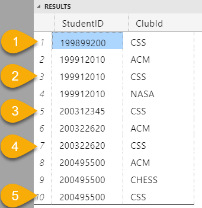


----

## [`C - Simple Select Exercise.sql`](./C%20-%20Simple%20Select%20Exercise.sql)

This document introduces the using the `GROUP BY` clause with aggregate functions using single tables. The following problem statements from this document illustrate reading a problem statement to discern the need for grouping.

> 10. Remember to jot notes or highlight parts of your problem statement. They can give direct clues to your solution, as in this sample problem.
> 
>     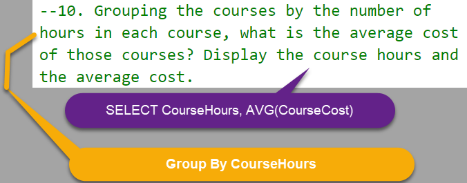
> 
>     The essense of this problem statement is that they want to see the correlation between course hours and average course costs.
> 
>     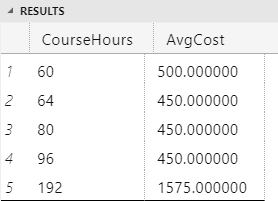
> 
> 11. Note that in this problem statement, we are told about the data that is needed and the sorting that has to be applied. Nothing explicit is mentioned about grouping, but the fact that both aggregate and non-aggregate data has to be retrieved should give us a hint that grouping by the `StaffID` is required.
> 
>     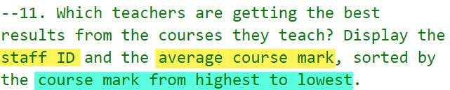

----

## [`D - Simple Joins Exercise.sql`](./D%20-%20Simple%20Joins%20Exercise.sql)

----

## [`E - String and Date functions.sql`](./E%20-%20String%20and%20Date%20functions.sql)

This document demonstrates the string and date functions available in SQL. The long multi-line comment at the start acts as a quick reference for the main string and date functions. This is followed by assorted samples and closes with problem statements that illustrate the need for these types of functions in solving SQL query problems.

----

## [`F - Inner Joins with Aggregates.sql`](./F%20-%20Inner%20Joins%20with%20Aggregates.sql)

----

## [`G - Outer Joins.sql`](./G%20-%20Outer%20Joins.sql)

----

## [`H - Subqueries.sql`](./H%20-%20Subqueries.sql)

This document demonstrates using subqueries in SQL.

| Example | Screenshot |
| ------- | ---------- |
| Q1)     | 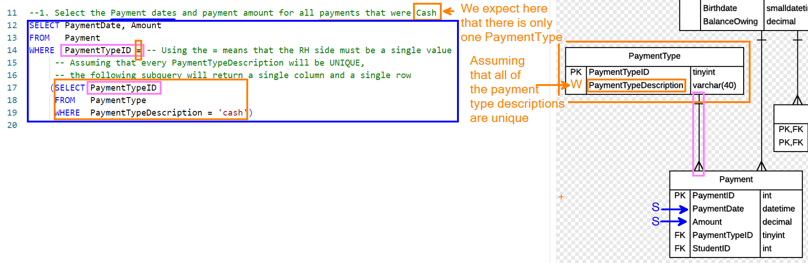 |
|         | 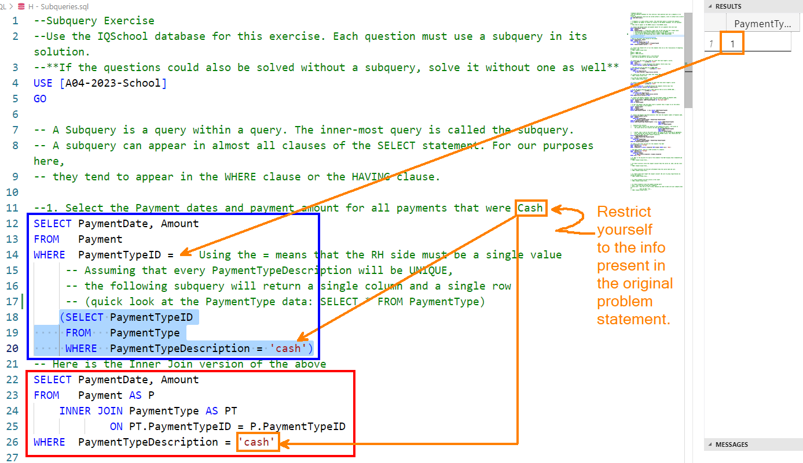 |
| Q3)     | 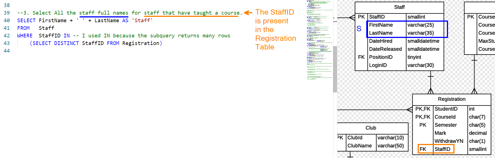 |
|         | 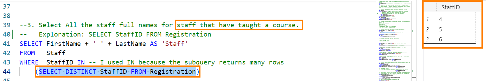 |
|         | 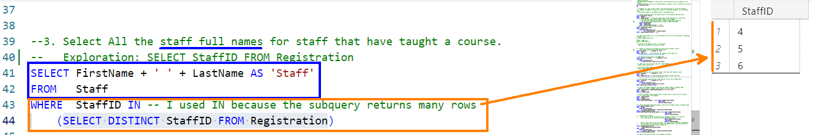 |
|         | 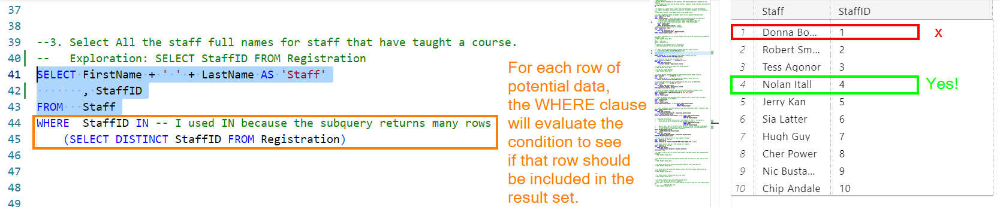 |
| Q5)     | 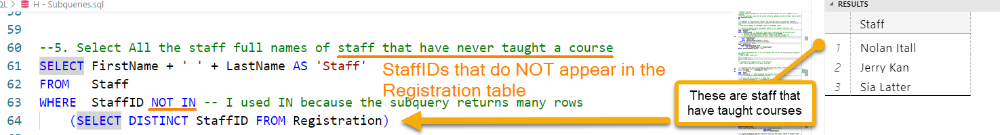 |
| Q6)     | 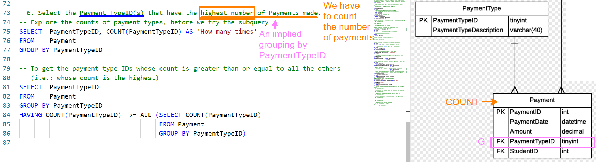 |
|         | 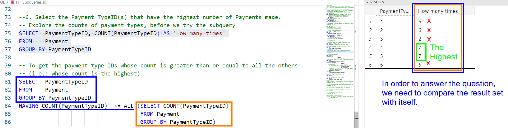 |
|         | 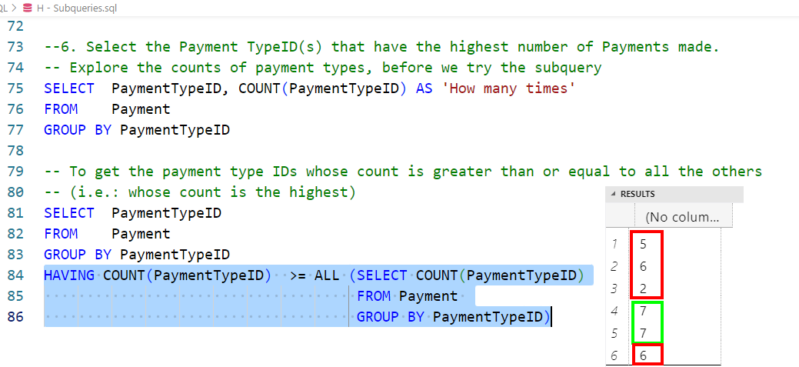 |


----

## [`I - Views.sql`](./I%20-%20Views.sql)

This document demonstrates how we can use frequently used queries as permanent views. A "View" in SQL is simply a query that is stored on the database. It gives us the following benefits:

- As a permanent part of our database, the SQL query underlying the view is managed by the database in a way that optimizes its performance.
- Views act as "pseudo-tables" and can become the subject of `FROM` clauses in other queries.
- Views are ideal for situations where we want a **"de-normalized"** perspective on the data in our database.

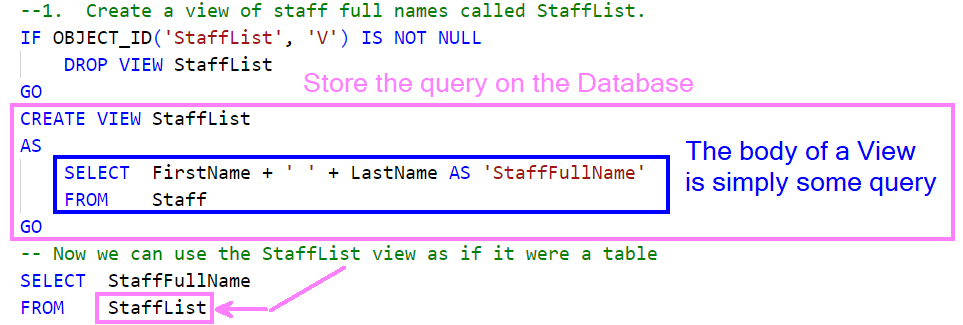

Views allow access to the underlying tables in our database for more than just queries, however. Views can also be the avenue for inserts/updates/deletes, though there will be some limitations and restrictions depending on the structure and complexity of the SQL query that represents the view.

----

## [`J - Unions.sql`](./J%20-%20Unions.sql)

----

## Roommates Database

The [script for the Roommates database](./Roommates.sql) consists of two tables with the following data (also as a [screenshot](./Images/RoommatesData.png)).

| PersonID | FirstName | LastName | RentalId | WantingRoommate |
|----------|-----------|----------|----------|-----------------|
| 400 | Sherlock | Holmes | 1 | NULL |
| 450 | John | Watson | 1 | NULL |
| 500 | Barney | Rubble | 2 | NULL |
| 550 | Fred | Flintstone | 2 | NULL |
| 600 | Wilma | Slaghoople | 3 | NULL |
| 650 | Betty | McBricker | 3 | NULL |

| RentalId | Unit | StreetAddress | City | MonthlyRent |
|----------|------|---------------|------|-------------|
| 1 | NULL | 221-B Baker Street | London | 500.00 |
| 2 | 101 | 105 Rockdale Ravine | Bedrock | 400.00 |
| 3 | 403 | 221 Rockdale Ravine | Bedrock | 450.00 |

----

## ERD for A0X-School


